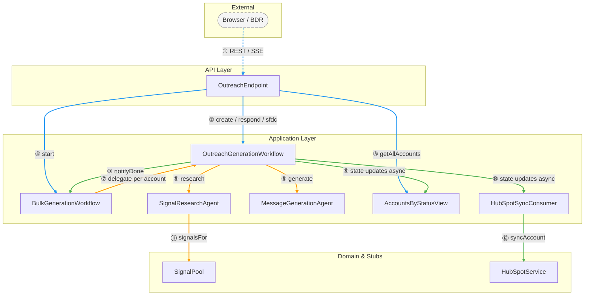
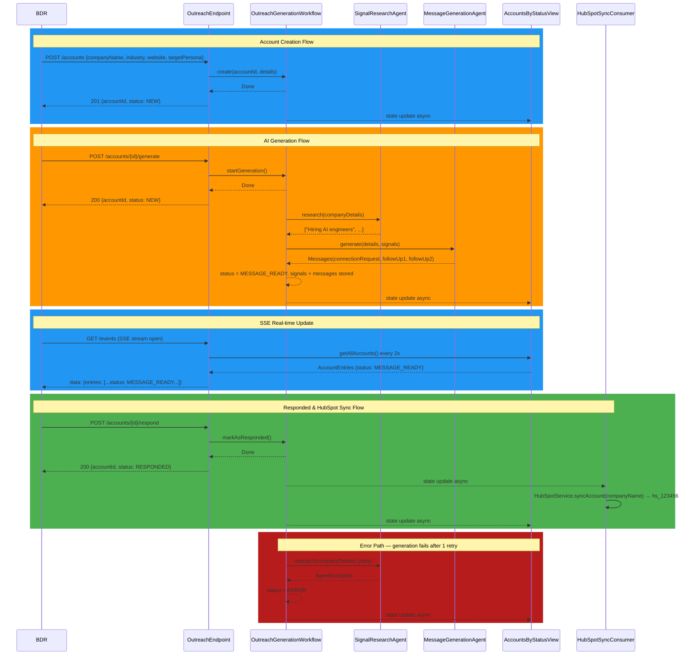
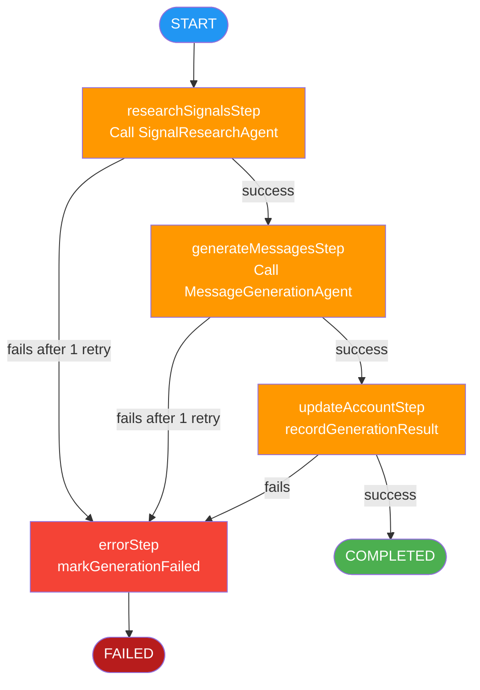
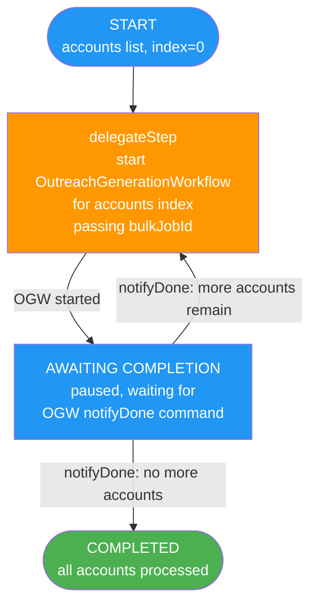

# BDR LinkedIn Outreach Tool

> AI-powered LinkedIn outreach assistant that generates persona-aware messages grounded in real company signals — so BDRs can go from a company name to three ready-to-send messages in under 60 seconds.

---

## Overview

The BDR Outreach Tool lets sales development reps enter a target company and receive three AI-crafted LinkedIn messages (connection request, first follow-up, second follow-up) tailored to the target persona and grounded in live company signals. It uses two Akka AI Agents (signal research + message generation) orchestrated by a durable Akka Workflow, a streaming SSE endpoint for real-time UI updates, and a View for account state — all served as a single page application with no separate deployment. HubSpot sync is triggered automatically when an account is marked as responded.

---

## Prerequisites

| Requirement | Version |
|-------------|---------|
| Java | 21+ |
| Maven | 3.9+ |
| Akka CLI | latest |
| `GOOGLE_API_KEY` | Google AI Gemini API key |

Install the Akka CLI: [Install Akka CLI](https://doc.akka.io/reference/cli/index.html)

---

## Quick Start

```bash
# 1. Set your Gemini API key
export GOOGLE_API_KEY=your-key-here

# 2. Build
mvn compile

# 3. Run locally
mvn compile exec:java

# 4. Open the UI
open http://localhost:9000
```

Verify the service is up:

```bash
curl http://localhost:9000/accounts
```

---

## Usage

### UI Usage

Open [http://localhost:9000](http://localhost:9000) in your browser. No login required.

#### Key Screens

| Screen | Description |
|--------|-------------|
| Single Account tab | Create one account, trigger generation, view signals and messages |
| Bulk Upload tab | Upload a CSV of up to 50 companies and run "Generate All" |

#### Single Account Walkthrough

1. **Fill in the form** — enter company name, industry, website, target persona, and optional notes. If the company name already exists you'll see a warning.
2. **Submit** — the account is created (status `NEW`) and appears in the list below the form.
3. **Click "Generate Messages"** — a loading indicator appears while the AI pipeline runs.
4. **View results** — signals and three ready-to-send LinkedIn messages appear; status changes to `MESSAGE_READY`.
5. **Mark as Responded** — status changes to `RESPONDED` and a HubSpot record ID appears automatically.
6. **Get SFDC Payload** — click to view a structured Salesforce-ready export on the page.

#### Bulk Upload Walkthrough

1. **Prepare a CSV** with columns: `companyName,industry,website,targetPersona,notes`
2. **Upload the CSV** on the Bulk Upload tab — all valid rows create accounts instantly; invalid rows show per-row errors.
3. **Click "Generate All"** — the AI runs sequentially for each account; the table updates in real time as statuses change from `NEW` → `MESSAGE_READY`.
4. **Expand a row** to see the full signals and messages for that account.

---

### API Reference

#### Accounts

**`POST /accounts`** — Create a new account.

```bash
curl -X POST http://localhost:9000/accounts \
  -H "Content-Type: application/json" \
  -d '{
    "companyName": "Acme Corp",
    "industry": "Software",
    "website": "https://acme.example.com",
    "targetPersona": "VP Engineering",
    "notes": "Met at KubeCon"
  }'
```

Response `201`:
```json
{ "accountId": "550e8400-e29b-41d4-a716-446655440000", "status": "NEW" }
```

---

**`GET /accounts`** — List all accounts.

```bash
curl http://localhost:9000/accounts
```

Response `200`:
```json
{
  "entries": [
    {
      "accountId": "...",
      "companyName": "Acme Corp",
      "industry": "Software",
      "website": "https://acme.example.com",
      "targetPersona": "VP Engineering",
      "notes": "",
      "status": "MESSAGE_READY",
      "signals": ["Hiring AI engineers", "Evaluating LLM orchestration platforms", "Expanding engineering team by 40%"],
      "messages": [
        { "messageType": "CONNECTION_REQUEST", "body": "..." },
        { "messageType": "FOLLOW_UP_1", "body": "..." },
        { "messageType": "FOLLOW_UP_2", "body": "..." }
      ],
      "hubspotId": null,
      "createdAt": "2026-03-25T10:00:00Z"
    }
  ]
}
```

---

**`POST /accounts/{accountId}/generate`** — Trigger AI message generation.

```bash
curl -X POST http://localhost:9000/accounts/550e8400-e29b-41d4-a716-446655440000/generate
```

Response `200`:
```json
{ "accountId": "...", "status": "NEW" }
```

Generation runs asynchronously; status updates arrive via SSE (`GET /events`).

---

**`POST /accounts/{accountId}/respond`** — Mark as responded. Triggers HubSpot sync automatically.

```bash
curl -X POST http://localhost:9000/accounts/550e8400-e29b-41d4-a716-446655440000/respond
```

Response `200`:
```json
{ "accountId": "...", "status": "RESPONDED" }
```

---

**`GET /accounts/{accountId}/sfdc`** — Get Salesforce-ready export payload.

```bash
curl http://localhost:9000/accounts/550e8400-e29b-41d4-a716-446655440000/sfdc
```

Response `200`:
```json
{
  "Company": "Acme Corp",
  "Industry": "Software",
  "Website": "https://acme.example.com",
  "TargetPersona": "VP Engineering",
  "LeadStatus": "Responded",
  "IntentSignals": ["Hiring AI engineers", "Evaluating LLM orchestration platforms", "Expanding engineering team by 40%"],
  "LinkedInMessages": {
    "ConnectionRequest": "...",
    "FollowUp1": "...",
    "FollowUp2": "..."
  },
  "HubSpotId": "hs_123456"
}
```

---

#### Bulk Upload

**`POST /accounts/bulk`** — Upload a CSV and create accounts in bulk.

```bash
curl -X POST http://localhost:9000/accounts/bulk \
  -H "Content-Type: text/csv" \
  --data-binary @accounts.csv
```

CSV format:
```
companyName,industry,website,targetPersona,notes
Acme Corp,Software,https://acme.example.com,VP Engineering,Met at KubeCon
Beta Inc,FinTech,https://beta.example.com,CFO,
```

Response `200`:
```json
{
  "total": 2,
  "created": 2,
  "rejected": []
}
```

---

**`POST /accounts/generate-all`** — Trigger AI generation for all NEW or ERROR accounts.

```bash
curl -X POST http://localhost:9000/accounts/generate-all
```

Response `200`:
```json
{ "bulkJobId": "...", "accountCount": 9 }
```

---

#### Real-time Updates

**`GET /events`** — Server-sent event stream of account state.

```bash
curl -N http://localhost:9000/events
```

Each event emits the full account list every ~2 seconds:
```
data: {"entries":[...]}

data: {"entries":[...]}
```

The browser reconnects automatically on disconnect (SSE spec).

---

### Configuration

| Key / Env Var | Default | Description |
|---------------|---------|-------------|
| `GOOGLE_API_KEY` | *(required)* | Google AI Gemini API key |
| `akka.javasdk.agent.model-provider` | `googleai-gemini` | LLM provider |
| `akka.javasdk.agent.googleai-gemini.model-name` | `gemini-2.0-flash` | Gemini model |
| `akka.javasdk.agent.googleai-gemini.response-timeout` | `60s` | Max LLM response wait |

---

## Architecture

### Components

| Component | Type | Responsibility |
|-----------|------|----------------|
| `OutreachGenerationWorkflow` | Workflow | Owns all account state; orchestrates signal research → message generation; handles create, generate, respond, and SFDC commands |
| `BulkGenerationWorkflow` | Workflow | Delegates to `OutreachGenerationWorkflow` per account sequentially; advances on `notifyDone` push |
| `SignalResearchAgent` | Agent | Single command `research(CompanyDetails)` → 3 deterministic intent signals via `@FunctionTool` |
| `MessageGenerationAgent` | Agent | Single command `generate(GenerateRequest)` → 3 persona-aware LinkedIn messages via Gemini |
| `AccountsByStatusView` | View | Reads workflow state; exposes `getAllAccounts()` and `getAccountById()` |
| `HubSpotSyncConsumer` | Consumer | Watches workflow state; triggers stub HubSpot sync on RESPONDED transition |
| `OutreachEndpoint` | HTTP Endpoint | All REST endpoints, SSE stream, and static UI serving |

### Data Model

- **Account** — `accountId` (UUID), `companyName`, `industry`, `website`, `targetPersona`, `notes`, `status`, `signals` (3 strings), `messages` (3 `OutreachMessage`), `hubspotId`, `createdAt`. Lives as `OutreachGenerationWorkflow` state — no separate entity.
- **OutreachMessage** — `messageType` (`CONNECTION_REQUEST` | `FOLLOW_UP_1` | `FOLLOW_UP_2`), `body`.
- **SignalPool** — static utility; `signalsFor(companyName)` returns 3 signals deterministically (hash-based selection from 5 pools, stable per JVM session).
- **BulkUpload** — not persisted; the CSV upload result is computed synchronously and returned in the HTTP response.

#### Status Transitions

```
NEW ──────────────────────────→ MESSAGE_READY ──→ RESPONDED
 │                                   │
 │  (generation fails after retry)   │  (re-generation allowed)
 └───────────────────────────────────→ ERROR ──→ NEW (on re-trigger)
```

### Diagrams

#### Component Dependencies



---

#### End-to-End Sequence



---

#### OutreachGenerationWorkflow State Machine



#### BulkGenerationWorkflow State Machine



---

### Design Decisions

| Decision | Rationale |
|----------|-----------|
| `OutreachGenerationWorkflow` as account owner (no separate entity) | Eliminates a component layer; workflow state is durable and naturally tied to account lifecycle |
| Two dedicated agents (research + generate) | Single-responsibility; each agent has one command handler; easy to mock in tests |
| `BulkGenerationWorkflow` push-notified by `OutreachGenerationWorkflow` | No polling; `notifyDone` command advances the bulk job exactly when each account completes |
| SSE via `Source.tick` polling the View every 2s | Stateless server-side; simple to implement; sufficient for MVP real-time UX (FR-030) |
| Deterministic signals via `String.hashCode() % 5` | Same company always returns same signals — enables repeatable demos (SC-002) |
| HubSpot stub: `hs_<hashCode % 1_000_000>` | Deterministic, plausible format; always succeeds; no external account needed (FR-017, SC-007) |
| Google Gemini (`gemini-2.0-flash`) via Akka SDK `googleai-gemini` provider | Built-in SDK support; fast and cost-effective for text generation with tool calling |
| Apache Commons CSV for bulk upload | Lightweight; clean header-based API; proper missing-column detection; zero transitive deps |

---

## Deployment

### Build Container Image

```bash
mvn clean install -DskipTests
```

### Deploy to Akka Cloud

```bash
akka service deploy bdr-outreach bdr-outreach:<tag> --push
```

Pass the API key as a secret:

```bash
akka secret create generic google-api-key --literal GOOGLE_API_KEY=your-key-here
akka service deploy bdr-outreach bdr-outreach:<tag> --push \
  --secret-env GOOGLE_API_KEY=google-api-key/GOOGLE_API_KEY
```

Monitor:

```bash
akka service list
akka service logs bdr-outreach
```

See [Deploy and manage services](https://doc.akka.io/operations/services/deploy-service.html) for more.

---

## Development

### Running Tests

```bash
# All tests (unit + integration)
mvn verify

# Single test class
mvn test -Dtest=OutreachGenerationWorkflowTest
```

### Project Structure

```text
src/main/java/com/example/
├── domain/
│   ├── Account.java                    # Workflow state record; with* mutation methods
│   ├── AccountStatus.java              # Enum: NEW, MESSAGE_READY, RESPONDED, ERROR
│   ├── OutreachMessage.java            # Record: MessageType enum + body
│   └── SignalPool.java                 # Deterministic signal lookup utility
├── application/
│   ├── OutreachGenerationWorkflow.java # Single-account pipeline + account state owner
│   ├── BulkGenerationWorkflow.java     # Bulk coordinator; delegates to OGW per account
│   ├── SignalResearchAgent.java        # Gemini agent: research signals
│   ├── MessageGenerationAgent.java     # Gemini agent: generate messages
│   ├── AccountsByStatusView.java       # View: query all accounts or by ID
│   └── HubSpotSyncConsumer.java        # Consumer: auto-sync on RESPONDED
└── api/
    └── OutreachEndpoint.java           # REST + SSE + static UI

src/main/resources/
├── application.conf                    # Gemini model config
└── static-resources/
    └── index.html                      # Single-page UI (HTML + CSS + JS inline)

src/test/java/com/example/
├── application/
│   ├── OutreachGenerationWorkflowTest.java
│   ├── SignalResearchAgentTest.java
│   └── MessageGenerationAgentTest.java
└── api/
    └── OutreachEndpointIntegrationTest.java

specs/001-bdr-outreach/                 # Design artifacts
├── spec.md
├── plan.md
├── data-model.md
├── research.md
├── contracts/http-api.md
└── checklists/requirements.md
```