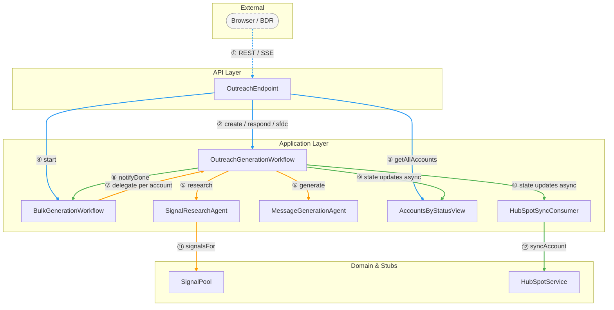
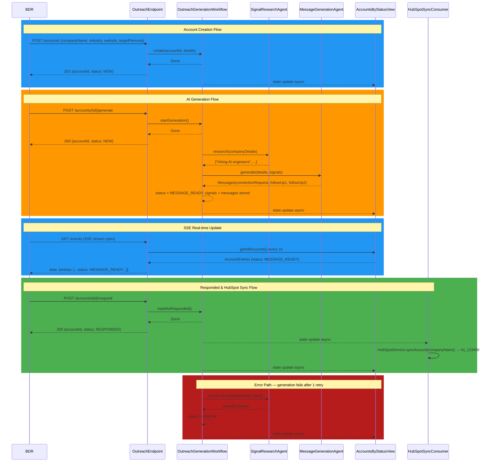
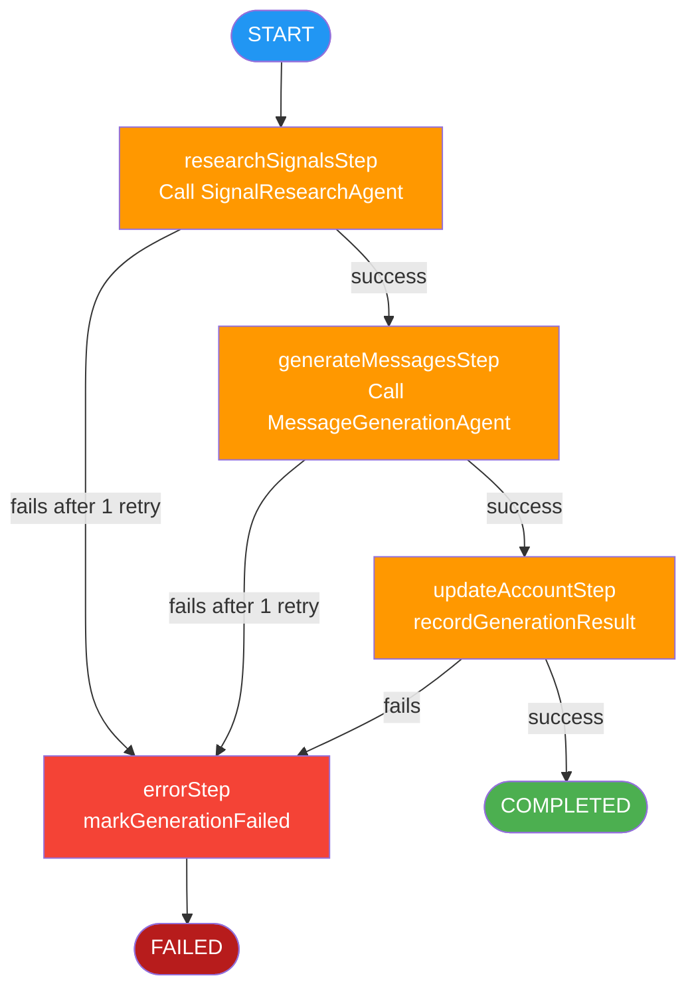
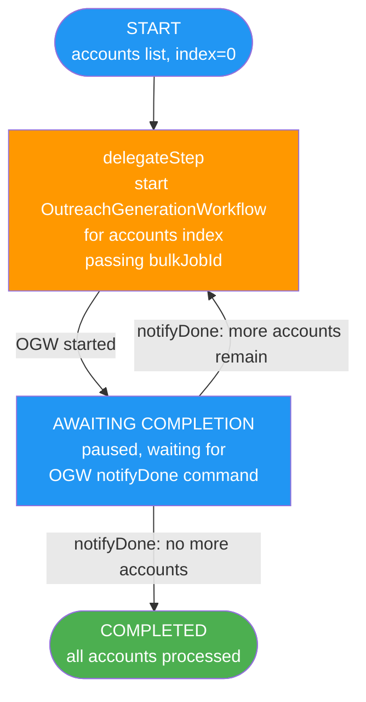

# Diagrams: BDR LinkedIn Outreach Tool

**Feature**: 001-bdr-outreach | **Plan**: [plan.md](plan.md)

## Color Conventions

| Flow Type | Color | Hex |
|-----------|-------|-----|
| Submission / happy-path | blue | `#2196F3` |
| Validation / processing | amber | `#FF9800` |
| Routing / delivery / success | green | `#4CAF50` |
| Error / failure | red | `#F44336` / `#B71C1C` |

---

## 1. Component Dependencies

---

## 2. Sequence Diagram

---

## 3. Workflow State Machines

### 3.1 OutreachGenerationWorkflow

### 3.2 BulkGenerationWorkflow

